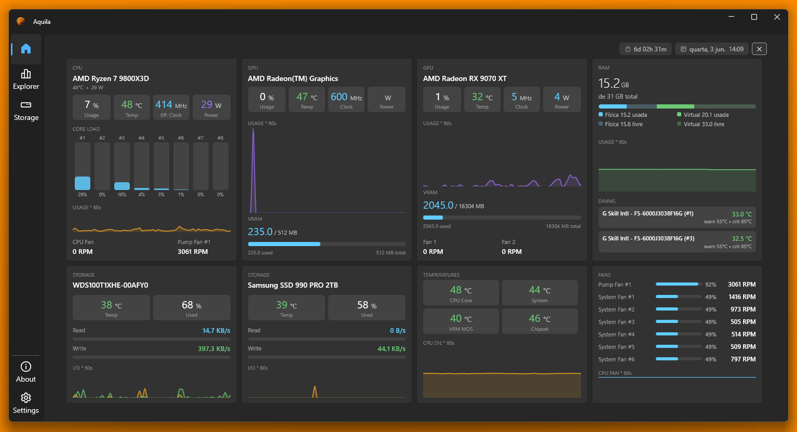
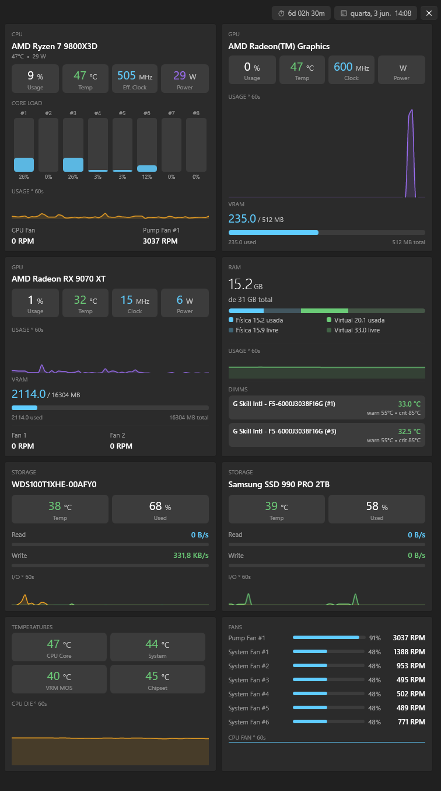
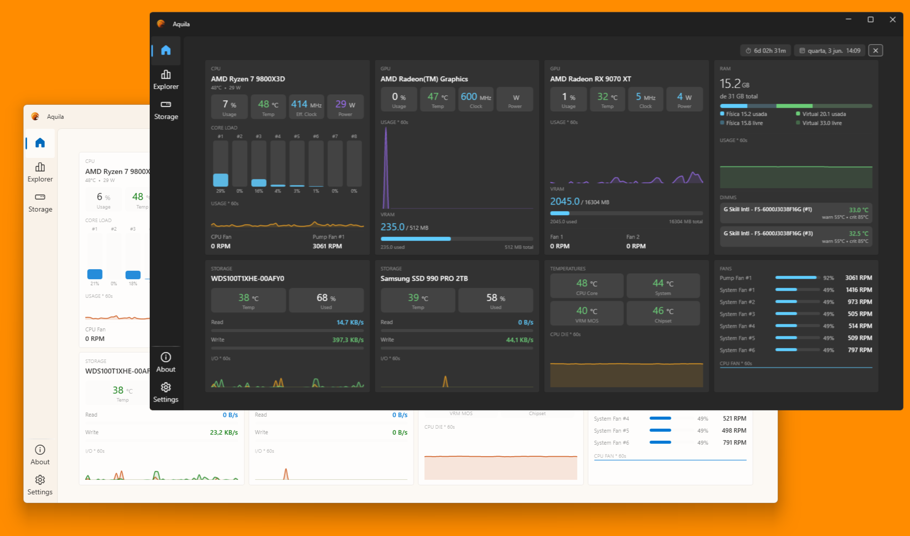
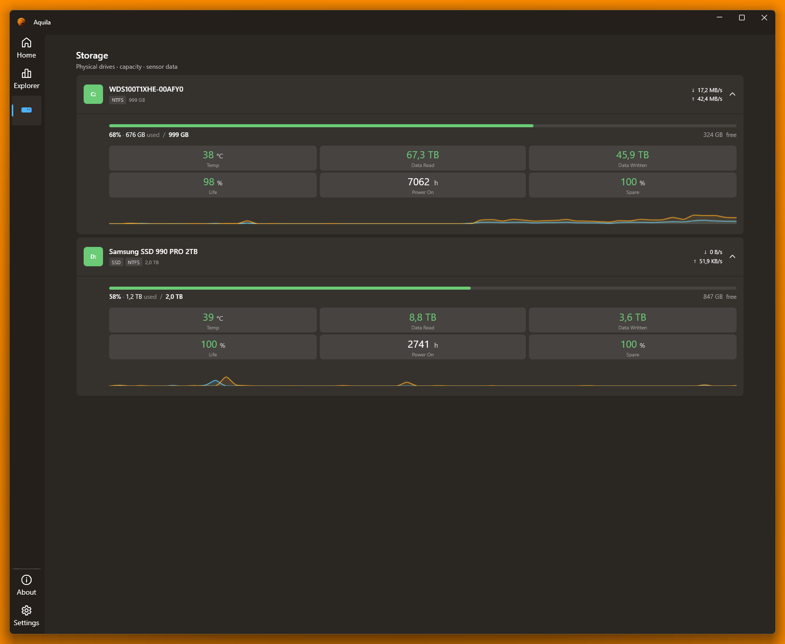
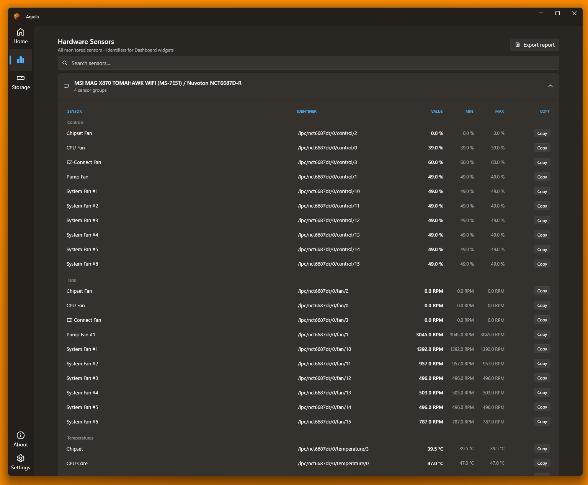

# Aquila

**A free, open-source Windows hardware monitor built for secondary screens.**

Real-time CPU, GPU, RAM, network and storage metrics in a clean, responsive WPF dashboard.

 

## Download

Grab the latest release from the [**Releases page**](https://github.com/JoaoCrv/Aquila/releases/latest):

- **`Aquila-win-Setup.exe`** — installer with automatic updates (recommended)
- **`Aquila-win-Portable.zip`** — portable build, no installation required

Once installed, Aquila checks for updates silently on startup and notifies you before downloading anything.

## Features

- **Borderless dashboard mode** — a frameless window you can pin to a secondary monitor or TV; opens and closes from anywhere, no restart
- **Responsive card grid** — cards reflow automatically as the window resizes; all cards in a row match the height of the tallest card
- **Real-time sparklines** — 60-second rolling history for CPU load, CPU die temperature, GPU load, RAM usage, network throughput, total system power and CPU fan speed
- **Light & dark themes** — follows a clean Fluent design across both
- **CPU** — load, temperature, clock and package power; per-core load bars
- **GPU** — load, temperature, core clock, power, VRAM usage and fan speeds; multi-GPU support
- **RAM** — used/available physical and virtual memory with a segmented bar; DIMM temperatures when available
- **Network** — live download/upload throughput and session totals
- **Storage** — temperature, used space, read/write rates, drive health; multi-drive support
- **Fans** — all motherboard fan channels with RPM bars and duty cycle
- **Power** — total system power with per-component breakdown
- **Motherboard temperatures** — all available thermal sensors in a grid
- **Sensor explorer** — raw access to every sensor the system exposes
- **System tray** — minimize to tray, start with Windows, start minimized

## Screenshots

### Dashboard mode

A borderless window designed to live on a second screen.

### Light & dark themes

### Storage & Explorer

<table>
  <tr>
    <td width="50%"></td>
    <td width="50%"></td>
  </tr>
</table>

## Demos

**Open & close the dashboard**

https://github.com/user-attachments/assets/30127f9f-57dd-417c-b11c-1c95b7347ae5

**Responsive layout**

https://github.com/user-attachments/assets/5e441247-ed95-4708-b9a6-e6ab05ecd68b

**Toggle cards from settings**

https://github.com/user-attachments/assets/fb986d27-9a97-4d8e-a4c5-4616ed307a43

## Project principles

- free to use
- open source under `MPL-2.0`
- no ads
- no telemetry or personal data collection
- optional network communication only for update checks and downloads through `Velopack`

## Privacy

Aquila does not require an account, does not include analytics, and does not collect personal data. The only intended internet communication is the optional update flow via `Velopack`, used to check for and download new releases.

## Support

Aquila is not sold as a commercial product by the maintainer. Optional donations may help support future development, but there are no paid features and no advertising in the app.

## Open-source dependencies

Aquila is built with and made possible by several open-source projects:

| Project                                                                              | Purpose                                   | License |
| ------------------------------------------------------------------------------------ | ----------------------------------------- | ------- |
| [LibreHardwareMonitor](https://github.com/LibreHardwareMonitor/LibreHardwareMonitor) | hardware sensors and monitoring data      | MPL-2.0 |
| [WPF-UI](https://github.com/lepoco/wpfui)                                            | Fluent-style WPF controls and navigation  | MIT     |
| [WPF-UI.DependencyInjection](https://github.com/lepoco/wpfui)                        | DI integration for WPF-UI                 | MIT     |
| [Velopack](https://github.com/velopack/velopack)                                     | packaging and in-app updates              | MIT     |
| [CommunityToolkit.Mvvm](https://github.com/CommunityToolkit/dotnet)                  | MVVM helpers, source generators, commands | MIT     |
| [LiveCharts2](https://github.com/beto-rodriguez/LiveCharts2)                         | charts and sparklines                     | MIT     |
| [Microsoft.Extensions.Hosting](https://github.com/dotnet/runtime)                    | dependency injection and app hosting      | MIT     |

## Maintainer

- [@JoaoCrv](https://github.com/JoaoCrv)

## Development

Aquila is developed with the assistance of [Claude Code](https://claude.ai/code) by Anthropic.

## License

This project is licensed under the terms of the **Mozilla Public License 2.0 (MPL-2.0)**.

You can find the full text in the `LICENSE` file at the root of this repository, or read it online at https://www.mozilla.org/MPL/2.0/.
